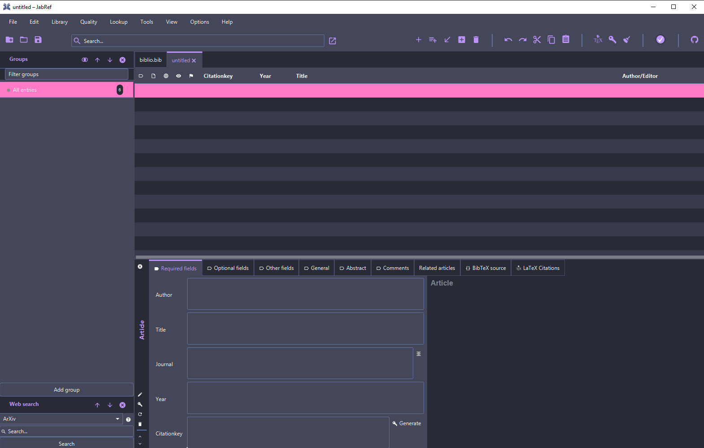

# Dracula Theme for JabRef


1. Clone this repository

``` shell
git clone https://github.com/Inf166/theme-jabref-dracula.git
```

2. Open your JabRef Program

3. Open the Options/Preferences


4. Go to the Appearance Section

5. And select Custom Theme


6. Select the dracula.css file from this repository

7. Press save and enjoy

```Note: It may load for a few seconds.```
