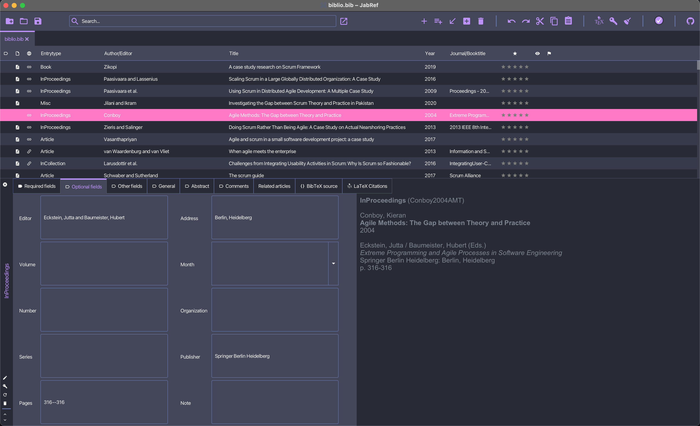

# Dracula for [JabRef](https://www.jabref.org/)

> A dark theme for [JabRef](https://www.jabref.org/).

## Install

All instructions can be found at [draculatheme.com/JabRef](https://github.com/Inf166/theme-jabref-dracula/blob/main/INSTALL.md).

## Team

This theme is maintained by the following person(s) and a bunch of [awesome contributors](https://github.com/dracula/JabRef/graphs/contributors).

|  |
| ---------------------------------------------------------------------------------------- |
| [Joel Mai](https://github.com/inf166)                                               |

## Community

- [Twitter](https://twitter.com/draculatheme) - Best for getting updates about themes and new stuff.
- [GitHub](https://github.com/dracula/dracula-theme/discussions) - Best for asking questions and discussing issues.
- [Discord](https://draculatheme.com/discord-invite) - Best for hanging out with the community.

## License

[GNU GENERAL PUBLIC LICENSE](./LICENSE)
